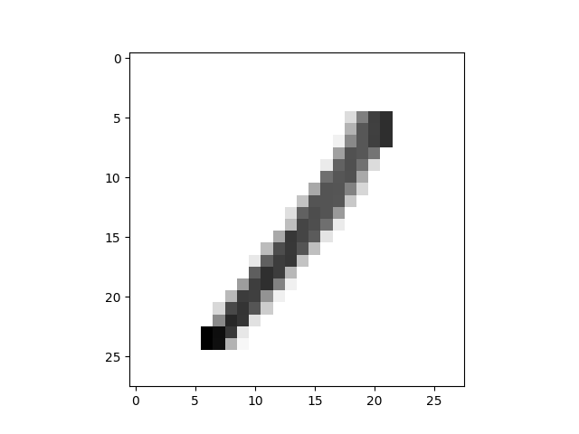
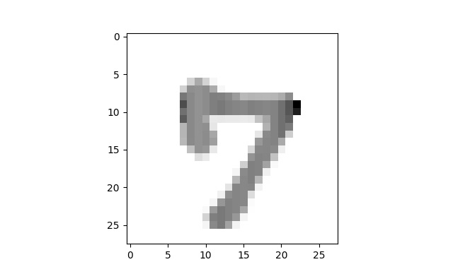
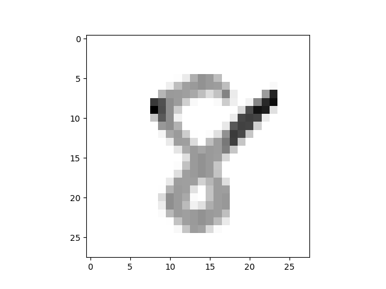
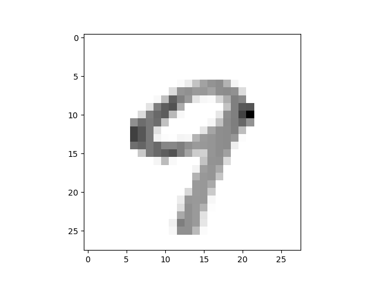

# Classification of handwritten digits

Simple classifier for predicting handwritten digits, based on the [MNIST database](https://en.wikipedia.org/wiki/MNIST_database).

## Examples

**Output**: My guess is... **1**.

**Output**: My guess is... **7**.

**Output**: My guess is... **8**.

**Output**: My guess is... **9**.
