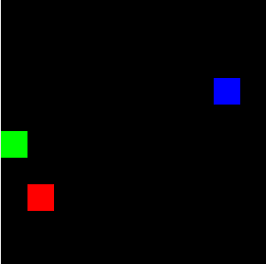

# Blob Game

  
The environment consists of three blob objects, namely: the agent, the food and the enemy. The objective is to make the agent learn to capture the food, which  gives them a positive reward, while avoiding the enemy, which is associated with negative reward.

In the image above, the agent is the blue tile, the food is the green tile and the enemy is the red one, considering an environment of size 10 x 10.

## Methodology

This problem can be solved through the use of Deep Q Networks (DQN). 

### DQNs

  
The architecture of a DQN is like a standard neural network where we pass an input. It produces an output and then we take the loss, let’s say (`predicted_value` - `actual_value`), and then we update the weights. 

For the input, because we are using images, we use a Convolutional Neural Network (CNN) and then pass the results to a sequential model to produce some output value for each action. 

The major difference is calculating the loss, and this is where replay memory and target network comes into play. Because Reinforcement Learning (RL) is not like supervised learning where we have clear labels for our data, we use the replay memory and the target network to come up the `actual value` that we then use for the loss (`predicted_value` - `actual_value`). This means that before we start training our network, we need to have the actual values for the states, so how do we get them?

#### Replay Memory

  
Remember that the network outputs q values that corresponds to an action that the agent can take. We pass in our state (observation), it produces different *q* values and then we pick one of those *q* values using epsilon greedy and take the action that is associated with that *q* value. After we have taken that action in the environment, we get back a reward and a new state. So, we now have a tuple that consists of . We then append that tuple to a list, and this process is repeated until we have reached some desired list size.

#### Target Network

  
Now that we have the replay memory filled, we can start training. We go and randomly pick a tuple from our replay memory. We pass in the state  that is in the tuple to the network and it produces some *q* values. We then pick the *q* value that is associated with the action  that we previously took in the tuple. This *q* value is going to be our `predicted_value`. To get the `actual_value` we pass in the  that is in our tuple to another network called the **Target Network**.

This network has the same architecture as our model, the only difference is that the weights remain frozen but every so often, we update the weights in
the target network to the same weights that we have in our model. The reason we use another network instead of our model for this step is that we need to make sure the weights don’t go changing every time. If they change every time, when we pass in  we would get a different `actual_value` for the same (state, action) pair, thus we wouldn’t be able to minimize the loss. So, freezing the values makes sure that this does not happen and that all the different states get treated the same way.

Anyway, we pass in  to the target network and then get the maximum *q* value that it produces. After that we pick that *q* value and the  in our tuple and we pass it into the Bellman equation  and this gives us the `actual_value`.

After that just plug it into the loss (`predicted_value` - `actual_value`) and then just do normal backpropagation.

## References

*  https://pythonprogramming.net/training-deep-q-learning-dqn-reinforcement-learning-python-tutorial/
