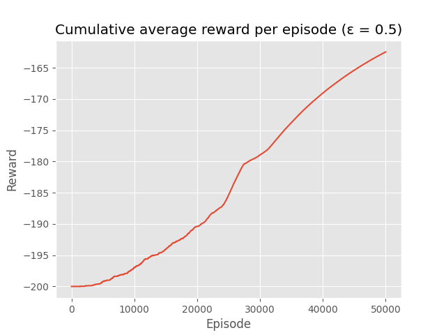

# MountainCar-v0

A car is on a one-dimensional track, positioned between two "mountains". The goal is to drive up the mountain on the right; however, the car's engine is not strong enough to scale the mountain in a single pass. Therefore, the only way to succeed is to drive back and forth to build up momentum. 

We will solve it using the basic **Q-learning** algorithm.

## Model evaluation

From the graph we can clearly see that as we run more episodes, our agent improves its ability to get better rewards. In other words, it learns to reach the flag in the long run.

## References

*  https://gym.openai.com/envs/MountainCar-v0/
*  https://en.wikipedia.org/wiki/Q-learning
